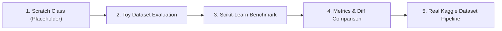

# Implementation Plan: Machine Learning Models from Scratch

A structured, professional framework for implementing, testing, and benchmarking 7 foundational Machine Learning algorithms from scratch, following a rigorous 5-step methodology.

---

## 1. Goal & Architecture Overview

The objective is to establish a modular, clean, and extensible workspace for learning machine learning algorithms from first principles:
1. **Linear Regression**
2. **Logistic Regression**
3. **k-Nearest Neighbors (k-NN)**
4. **Naive Bayes (Gaussian)**
5. **Decision Trees (CART / Classification & Regression)**
6. **k-Means Clustering**
7. **Principal Component Analysis (PCA)**

### 5-Stage Lifecycle per Model
For each algorithm, the script will execute this pipeline:


> [!IMPORTANT]
> **Strict No-Spoiler Policy for Scratch Implementation**:
> Per your instructions, all `from_scratch` classes will contain **only interface scaffolding, type annotations, mathematical docstrings with input/output shape specs, and static placeholder return values** (e.g. `np.zeros(n_samples)`). Zero algorithmic logic will be provided so you can build every algorithm independently.

---

## 2. Directory Structure

```
ML from Scratch/
│
├── data/
│   ├── toy_dataset.json            # Multi-purpose unified toy dataset in JSON
│   ├── toy_dataset.csv             # Converted tabular CSV dataset
│   └── convert_json_to_csv.py      # Conversion script with data validation
│
├── docs/
│   ├── plan.md                     # Technical implementation plan
│   └── walkthrough.md              # Project walkthrough and verification report
│
├── results/
│   └── {model}_{date}_{index}.md   # Auto-indexed benchmark reports
│
├── utils/
│   ├── __init__.py
│   ├── data_loader.py              # Helper to load and split toy & real data
│   └── metrics.py                  # Formatted comparison tables & metrics reporting
│
├── 01_linear_regression.py         # Linear Regression Boilerplate
├── 02_logistic_regression.py       # Logistic Regression Boilerplate
├── 03_knn.py                       # k-Nearest Neighbors Boilerplate
├── 04_naive_bayes.py               # Gaussian Naive Bayes Boilerplate
├── 05_decision_trees.py            # Decision Tree Classifier/Regressor Boilerplate
├── 06_kmeans.py                    # k-Means Clustering Boilerplate
├── 07_pca.py                       # Principal Component Analysis Boilerplate
└── requirements.txt                # Dependencies (numpy, pandas, scikit-learn, tabulate)
```

---

## 3. Unified Toy Dataset Design (`toy_dataset.json` & `convert_json_to_csv.py`)

A single, clean multi-task toy dataset (e.g. 50-100 structured samples) containing:
- **Continuous Features**: `feature_1`, `feature_2`, `feature_3`, `feature_4`
- **Regression Target**: `target_regression` (continuous numerical target)
- **Binary Classification Target**: `target_binary` (0 or 1)
- **Multiclass Classification Target**: `target_multiclass` (0, 1, or 2)
- **Cluster/Unsupervised Data**: Uses the feature matrix for `k-Means` and `PCA`

`convert_json_to_csv.py` will:
- Read `toy_dataset.json`
- Validate schema and types
- Export a clean `toy_dataset.csv`
- Provide summary statistics

---

## 4. Kaggle Real Dataset Recommendations

| Algorithm | Recommended Kaggle Dataset | Primary Task | Reason / Dataset Highlight |
| :--- | :--- | :--- | :--- |
| **Linear Regression** | [Medical Cost Personal Datasets](https://www.kaggle.com/datasets/mirichoi0218/insurance) | Continuous Price/Cost Prediction | Clear linear/polynomial relationships with numerical & categorical features. |
| **Logistic Regression** | [Titanic: Machine Learning from Disaster](https://www.kaggle.com/c/titanic) | Binary Classification (Survival) | Classic binary benchmark with clean feature engineering potential. |
| **k-NN** | [Breast Cancer Wisconsin Diagnostic](https://www.kaggle.com/datasets/uciml/breast-cancer-wisconsin-data) | Binary / Multiclass Distance-based Classification | Clean continuous features where Euclidean / Manhattan distances perform exceptionally well. |
| **Naive Bayes** | [SMS Spam Collection Dataset](https://www.kaggle.com/datasets/uciml/sms-spam-collection-dataset) or [Wine Quality Dataset](https://www.kaggle.com/datasets/yasserh/wine-quality-dataset) | Text / Feature Probability Classification | Highlights conditional probability and feature independence assumptions. |
| **Decision Tree** | [Loan Prediction Problem Dataset](https://www.kaggle.com/datasets/altruistdelhire04/loan-prediction-problem-dataset) | Tabular Decision Rule Classification | Intuitive feature thresholds (income, credit history) that map well to tree splits. |
| **k-Means** | [Mall Customer Segmentation Data](https://www.kaggle.com/datasets/vjchoudhary7/customer-segmentation-tutorial-in-python) | Unsupervised Customer Clustering | Well-separated clusters in 2D/3D (Annual Income vs Spending Score). |
| **PCA** | [MNIST Digits Dataset (Subset)](https://www.kaggle.com/datasets/oddrationale/mnist-in-csv) | High-Dimensional Dimensionality Reduction | 784-dimensional pixel data perfectly illustrates variance reduction and reconstruction. |

---

## 5. Model Boilerplate Architecture

Each of the 7 scripts (`01_linear_regression.py` to `07_pca.py`) will be self-contained and structured into standard sections:

1. **Imports & Configuration**: Type annotations, NumPy, Pandas, Scikit-learn equivalent.
2. **Scratch Class Scaffold**:
   ```python
   class CustomLinearRegression:
       """
       Linear Regression implemented from scratch.
       
       Mathematical Model:
           y_pred = X @ w + b
       Loss Function:
           MSE = (1 / (2 * m)) * sum((y_pred - y)^2)
       """
       def __init__(self, learning_rate: float = 0.01, n_iterations: int = 1000):
           self.lr = learning_rate
           self.n_iterations = n_iterations
           self.weights = None
           self.bias = None

       def fit(self, X: np.ndarray, y: np.ndarray) -> "CustomLinearRegression":
           # TODO: Implement parameter initialization and gradient descent / normal equation
           n_samples, n_features = X.shape
           self.weights = np.zeros(n_features)
           self.bias = 0.0
           return self

       def predict(self, X: np.ndarray) -> np.ndarray:
           # TODO: Implement prediction logic
           # Static placeholder return value:
           return np.zeros(X.shape[0])
   ```
3. **Step 2: Toy Data Run**: Loads `toy_dataset.csv`, fits custom model, generates output.
4. **Step 3: Sklearn Baseline Run**: Trains `sklearn.linear_model.LinearRegression` on the exact same train/test split.
5. **Step 4: Comparison & Diagnostics**: Side-by-side metric comparison table (e.g. MSE, RMSE, $R^2$, Accuracy, Silhouette Score) and parameter comparison.
6. **Step 5: Real Dataset Hook**: Ready-to-run skeleton to point to the downloaded Kaggle CSV.

---

## 6. Verification Plan

### Automated Tests
- Execute `convert_json_to_csv.py` to verify JSON reading, validation, and CSV generation.
- Execute each of the 7 scripts (`01_linear_regression.py` through `07_pca.py`) with `python <file>` to ensure zero runtime syntax/type errors, verify that placeholder models run gracefully, sklearn baselines run accurately, and comparison tables render properly.

### Manual Verification
- Verify that no solution algorithm logic is present in the scratch classes.
- Verify that table comparisons cleanly distinguish between Scratch and Sklearn results.
